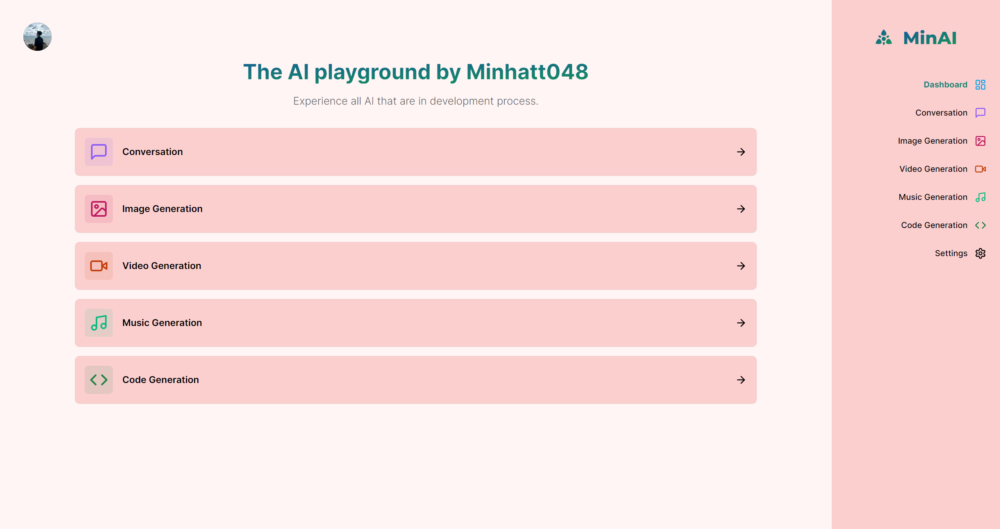

<!-- Improved compatibility of back to top link: See: https://github.com/othneildrew/Best-README-Template/pull/73 -->

<a name="readme-top"></a>

<!--
*** Thanks for checking out the Best-README-Template. If you have a suggestion
*** that would make this better, please fork the repo and create a pull request
*** or simply open an issue with the tag "enhancement".
*** Don't forget to give the project a star!
*** Thanks again! Now go create something AMAZING! :D
-->

<!-- PROJECT SHIELDS -->
<!--
*** I'm using markdown "reference style" links for readability.
*** Reference links are enclosed in brackets [ ] instead of parentheses ( ).
*** See the bottom of this document for the declaration of the reference variables
*** for contributors-url, forks-url, etc. This is an optional, concise syntax you may use.
*** https://www.markdownguide.org/basic-syntax/#reference-style-links
-->

[![Contributors][contributors-shield]][contributors-url]
[![Forks][forks-shield]][forks-url]
[![Stargazers][stars-shield]][stars-url]
[![Issues][issues-shield]][issues-url]
[![MIT License][license-shield]][license-url]
[](https://www.facebook.com/Minhatt048/)

<!-- PROJECT LOGO -->
<br />
<div align="center">
  <a href="https://min-ai.vercel.app/">
    
  </a>
  <h3 align="center">
   A free experimental AI compilation platform for everyone.
    <br />
    <a href="https://github.com/Minhnhat0408/Diligent/issues">Report Bug</a>
    ·
    <a href="https://github.com/Minhnhat0408/Diligent/issues">Request Feature</a>
  </h3>
  <p> Note that most of the models aren't updated yet. Please wait</p>
</div>

<!-- TABLE OF CONTENTS -->
<details>
  <summary>Table of Contents</summary>
  <ol>
    <li>
      <a href="#about-the-project">About MinAI</a>
      <ul>
        <li><a href="#built-with">Built With</a></li>
      </ul>
    </li>
    <li><a href="#feature">Feature</a></li>
    <li><a href="#roadmap">Roadmap</a></li>
    <li><a href="#clone-and-installation">Clone And Installation</a></li>
    <li><a href="#contributing">Contributing</a></li>
    <li><a href="#license">License</a></li>
    <li><a href="#contact">Contact</a></li>
  </ol>
</details>

<!-- ABOUT THE PROJECT -->

## About The Project

MinAI is a free AI compilation platform with AI API and models on huggingface. It the project that set out my journey on AI field, later on I will be the one who wrotes all the remainings models for my own website. Hope you guys can support me. Tks

<p align="right">(<a href="#readme-top">back to top</a>)</p>

### Built With

-   
-   
-   
-   
-   [Clerk for Authentication](https://clerk.com/)
-   [Shadcn UI](https://ui.shadcn.com/)

<p align="right">(<a href="#readme-top">back to top</a>)</p>


## Feature

**1. Sign in/Sign up with Google, Facebook , Github or traditionally:**


**2. Landing Page**

 

**3. DashBoard Page**

 

**4. Image Generation** 


**5. Profile update**


 <p align="right">(<a href="#readme-top">back to top</a>)</p>
<!-- ROADMAP -->

## Roadmap

-   [x] Add landing page
-   [x] Add conversation API
-   [x] Add Image generation API
-   [ ] Add Video generataion
-   [ ] Add Code generation
-   [ ] Add Music generation

   

<p align="right">(<a href="#readme-top">back to top</a>)</p>

<!-- CONTRIBUTING -->

## Clone And Installation

Clone the project

```bash
  git clone https://github.com/Minhnhat0408/MinAI
```

Go to the project directory

```bash
  cd MinAI
```

Install dependencies

```bash
  npm install
  yarn
```

Start the server

```bash
  npm run dev
  yarn run dev
```
## Environment Variables

To run this project, you will need to add the following environment variables to your .env file 
All keys in clerk and huggingface:
- `NEXT_PUBLIC_CLERK_PUBLISHABLE_KEY` 
- `CLERK_SECRET_KEY`
- `NEXT_PUBLIC_CLERK_SIGN_IN_URL=/sign-in`
- `NEXT_PUBLIC_CLERK_SIGN_UP_URL=/sign-up`
- `NEXT_PUBLIC_CLERK_AFTER_SIGN_IN_URL=/dashboard`
- `NEXT_PUBLIC_CLERK_AFTER_SIGN_UP_URL=/dashboard`
- `HUGGINGFACE_API_KEY`

## Contributing

Contributions are what make the open source community such an amazing place to learn, inspire, and create. Any contributions you make are **greatly appreciated**.

If you have a suggestion that would make this better, please fork the repo and create a pull request. You can also simply open an issue with the tag "enhancement".
Don't forget to give the project a star! Thanks again!

1. Fork the Project
2. Create your Feature Branch (`git checkout -b feature/AmazingFeature`)
3. Commit your Changes (`git commit -m 'Add some AmazingFeature'`)
4. Push to the Branch (`git push origin feature/AmazingFeature`)
5. Open a Pull Request

<p align="right">(<a href="#readme-top">back to top</a>)</p>

<!-- LICENSE -->

## License

Distributed under the MIT License. See `LICENSE.txt` for more information.

<p align="right">(<a href="#readme-top">back to top</a>)</p>

<!-- CONTACT -->

## Contact

Nguyễn Nhật Minh - [@Minhatt048](https://www.facebook.com/Minhatt048/) - kurominhnhat@gmail.com

Project Link: [MinAI - AI compilation platform](https://github.com/Minhnhat0408/MinAI)

<p align="right">(<a href="#readme-top">back to top</a>)</p>

<!-- MARKDOWN LINKS & IMAGES -->
<!-- https://www.markdownguide.org/basic-syntax/#reference-style-links -->

[contributors-shield]: https://img.shields.io/github/contributors/Minhnhat0408/MinAI.svg?style=for-the-badge
[contributors-url]: https://github.com/Minhnhat0408/MinAI/graphs/contributors
[forks-shield]: https://img.shields.io/github/forks/Minhnhat0408/MinAI.svg?style=for-the-badge
[forks-url]: https://github.com/Minhnhat0408/MinAI/network/members
[stars-shield]: https://img.shields.io/github/stars/Minhnhat0408/MinAI.svg?style=for-the-badge
[stars-url]: https://github.com/Minhnhat0408/MinAI/stargazers
[issues-shield]: https://img.shields.io/github/issues/Minhnhat0408/MinAI.svg?style=for-the-badge
[issues-url]: https://github.com/Minhnhat0408/MinAI/issues
[license-shield]: https://img.shields.io/github/license/Minhnhat0408/MinAI.svg?style=for-the-badge
[license-url]: https://github.com/Minhnhat0408/MinAI/blob/master/LICENSE.txt
[product-screenshot]: images/screenshot.png
[React.js]: https://img.shields.io/badge/React-20232A?style=for-the-badge&logo=react&logoColor=61DAFB
[React-url]: https://reactjs.org/
account